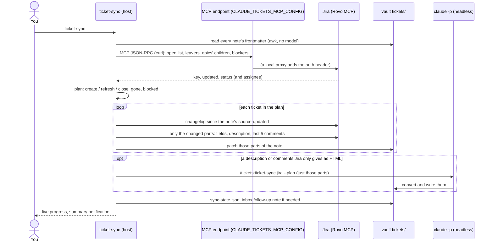
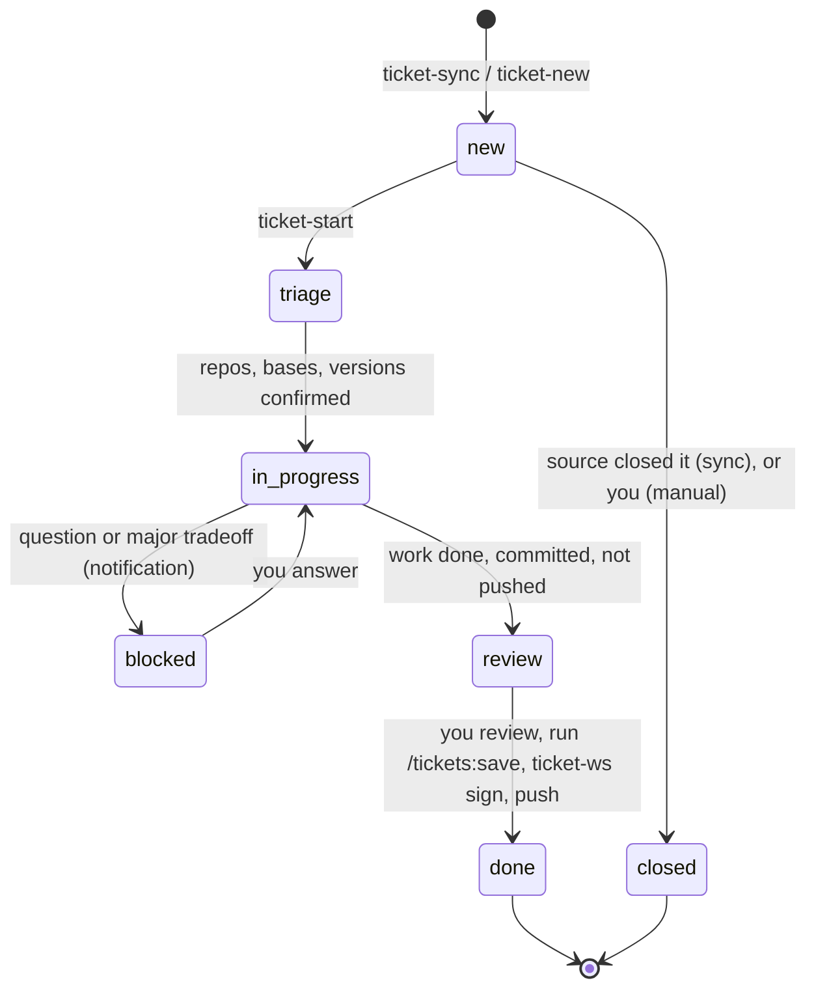
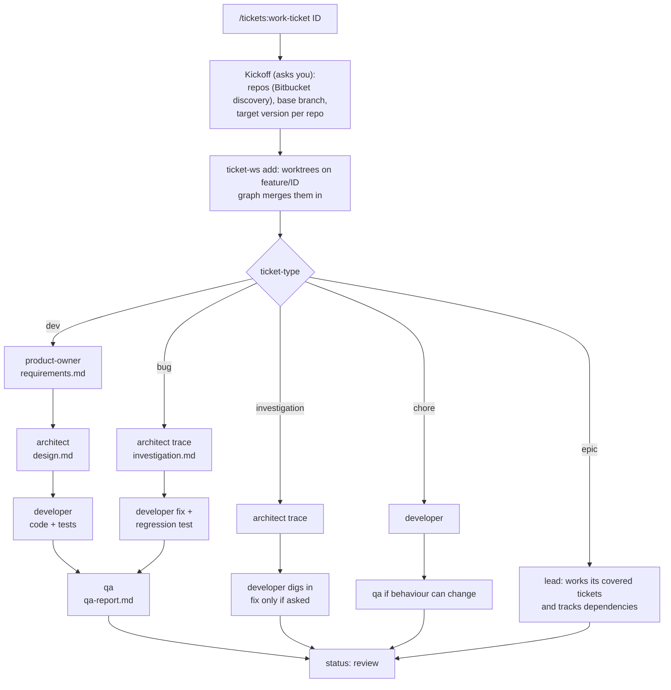
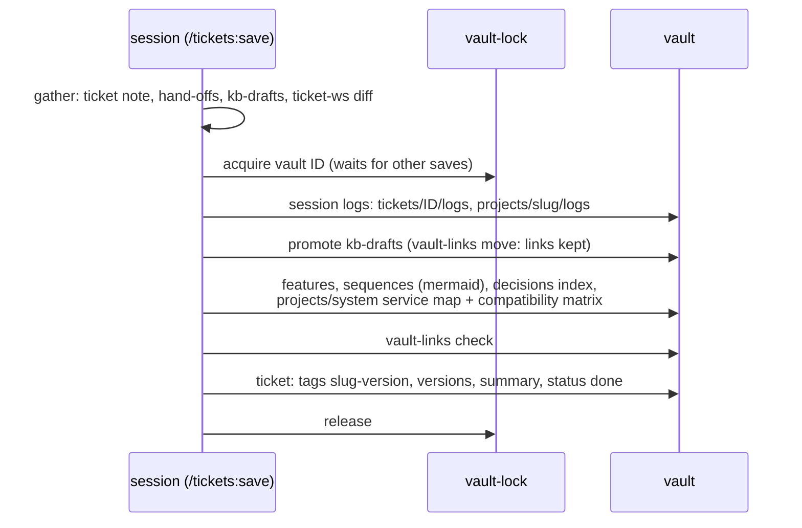
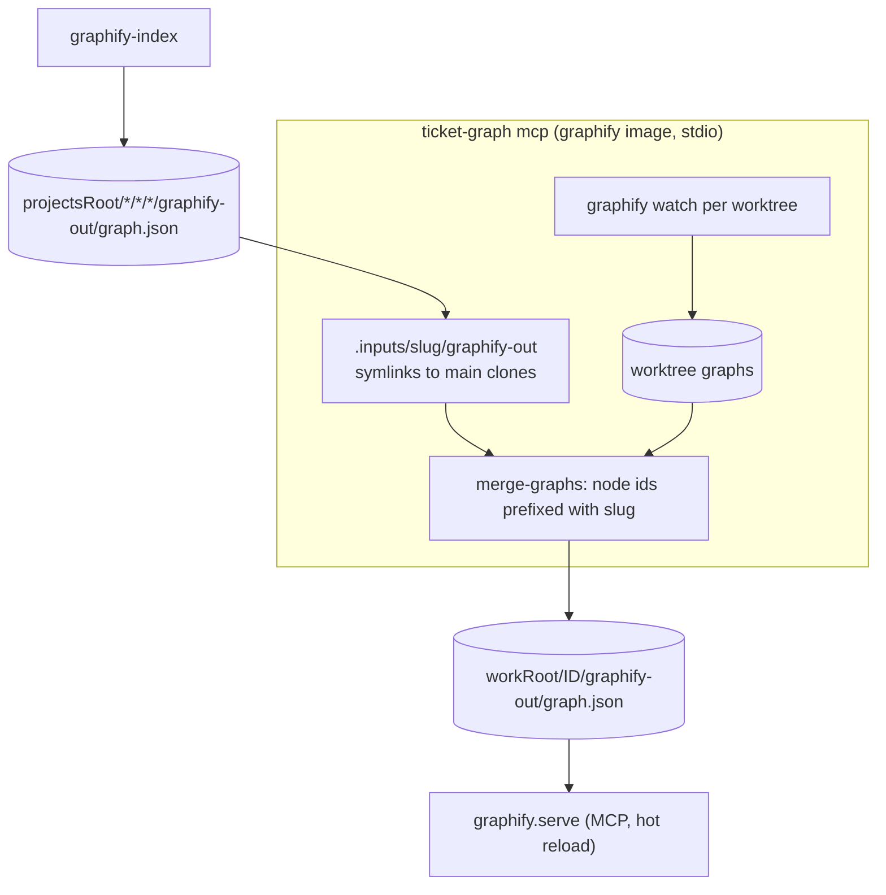

# claude-tickets

Parallel Claude Code sessions that work tickets end to end, with an Obsidian
vault as their long-term memory. You stay in charge of the final review:
agents commit on the ticket branches, and you review, sign and push.

What it gives you:

- **Ticket sync:** your open tickets from Jira (or any source with an MCP
  server and an adapter) are pulled into the vault, unsupervised. Manual
  tickets are written in the vault and never synced.
- **One session per ticket:** each runs in its own tmux window, with role
  agents (product owner, architect, developer, QA). Each session keeps a
  task list in the ticket note and gets its own git worktrees, and you get
  a desktop notification when it needs you.
- **Knowledge base:** the vault holds what the sessions learn: projects
  named by repo slug, the features and versions they shipped in, and data
  flows across services as mermaid diagrams. `kb` answers questions about
  the system without a ticket.
- **A code graph:** graphify gives every session the call graph of the
  repos it works in, across services, so it reads less code.

It's plain Claude Code underneath: sessions run your `claude` command with
standard flags (`--plugin-dir`, `--add-dir`, `--mcp-config`, `--settings`),
so they work the same unsandboxed or inside a sandbox that wraps `claude`.

| Part | What |
|---|---|
| `tools/` | the commands (`ticket-*`, `kb`, `claude-vault`, `vault-*`, `graphify-index`, `repo-layout`), `tickets-lib.sh` (prepended to each), `vault-scaffold/` (what `vault-init` copies), the zsh completion |
| `plugin/` | the Claude Code plugin `tickets`: skills (`/tickets:work-ticket`, `/tickets:pr-feedback`, `/tickets:ticket-sync`, `/tickets:kb`, `/tickets:save`, `/tickets:recall`), the role agents (`tickets:product-owner`, ...), and the hooks that tell `ticket-status` what a session is doing |
| `graph/` | the graphify image (`ticket-graph`) and the merger behind each session's code graph |
| `nix/`, `flake.nix` | the package, a home-manager module, and Obsidian modules (Linux, Flathub) |
| `install.sh` | installing without Nix |

The vault's own `AGENTS.md` is the rulebook the agents follow inside the
vault (note rules, ticket structure, who writes what). This README is the
operator's view.

## Install

**Nix (home-manager).** Add the flake as an input and import its module:

```nix
inputs.claude-tickets.url = "github:<you>/claude-tickets";   # or git+file:///path
# home-manager:
imports = [ inputs.claude-tickets.homeModules.claudeTickets ];
programs.claude-tickets.enable = true;
```

`nix profile install github:<you>/claude-tickets` works too, without the
module's settings (set the environment variables below yourself).
`homeModules.obsidianVaults` seeds vaults with the Tasks plugin, its settings
and the Minimal theme (`programs.claude-tickets.obsidian.vaults`), and
`nixosModules.obsidian` installs the Flathub Obsidian scoped to the vault
folder (needs [nix-flatpak](https://github.com/gmodena/nix-flatpak)).

**Without Nix:** `./install.sh [--prefix ~/.local]`, and `./install.sh
--uninstall` to remove it. It checks the dependencies and lists what's
missing: bash 4+, git, jq, gawk, curl, tmux, fzf, flock, GNU coreutils,
sed and findutils, podman or docker, and Claude Code. On macOS, use
Homebrew's `bash coreutils gnu-sed findutils gawk flock`; the scripts pick
the `g`-prefixed tools. Windows works through WSL2.

Then set up a vault with `vault-init <name>` (it creates it under
`~/Documents/Obsidian` if needed) and make it the default.

## Configuration

Everything is optional. The home-manager module builds these into the
commands from `programs.claude-tickets.*` (so they apply right after a
switch, in every shell and tmux window); an exported variable still wins.
Without the module, export them.

| Variable | What |
|---|---|
| `CLAUDE_TICKETS_CLAUDE` | the claude command sessions run, with any extra arguments (default `claude`) |
| `CLAUDE_TICKETS_SESSION_SETTINGS` | a Claude settings JSON merged into every ticket and kb session's `.claude/settings.json`: your own rules (see below) |
| `CLAUDE_TICKETS_MCP_CONFIG` | a standard MCP config (`{"mcpServers": {"<name>": {"type": "http", "url": …, "headers": {…}}}}`) naming each server the ticket sources use; `ticket-sync` talks to them directly |
| `CLAUDE_TICKETS_MCP_PREPARE` | a command run before `ticket-sync` talks to them (e.g. starting a local proxy) |
| `CLAUDE_TICKETS_CONTAINER` | `podman` or `docker` for the code graph (default: `vault-configure --section runtime`, else detected; podman's docker alias counts as podman) |
| `CLAUDE_TICKETS_SYSTEMD_SLICE` | systemd user slice the graph containers run in (Linux) |
| `CLAUDE_TICKETS_EDITOR` | editor of `ticket-open` (default `code`) |
| `CLAUDE_TICKETS_CACHE` | cache dir (default `~/.cache/claude-tickets`) |
| `OBSIDIAN_ROOT` | where the vaults live (default `~/Documents/Obsidian`) |

`CLAUDE_TICKETS_VAULT` is set by the commands for the sessions they start
(so their tools act on the same vault); don't set it yourself. When a
sandbox wraps `claude`, let it pass `CLAUDE_TICKETS_*` variables through.

### What sessions get

A ticket session runs, in its workspace:

```
claude --plugin-dir <plugin> \
  --add-dir=<vault> --add-dir=<projectsRoot> --add-dir=<each main clone's .git> \
  --add-dir=<cache>/graphify \
  --mcp-config <workspace>/.claude/graph-mcp.json \
  --permission-mode auto [--continue] "/tickets:work-ticket <ID>"
```

and the workspace's `.claude/settings.json` holds the one rule the ticket
system needs: **the main clones and the graph cache are never edited**
(`Edit`/`Write`/`NotebookEdit` denied under `projectsRoot` and the cache;
worktrees exist so the main clones stay untouched, and the graphs rely on
it), plus `CLAUDE_TICKETS_SESSION_SETTINGS` merged in. A sandbox can read
the same flags and rules to decide what to mount, and how.

### Recommended session settings

Not required, but what the workflow was built with: sessions commit, but
never push, rewrite history or remove worktrees, and can't relax their own
rules. For an Atlassian source, also deny the Rovo tools that cost credits
(`<server>` is the source's `mcp` name):

```json
{ "permissions": { "deny": [
  "Bash(git push:*)", "Bash(git reset --hard:*)", "Bash(git worktree remove:*)",
  "Bash(git branch -D:*)", "Bash(git clean:*)", "Bash(ticket-ws rm:*)",
  "Edit(.claude/settings.json)", "Write(.claude/settings.json)",
  "mcp__<server>__search", "mcp__<server>__getGraphContext",
  "mcp__<server>__getGraphObject", "mcp__<server>__addGraphContext",
  "mcp__<server>__getTeamworkGraphContext"
] } }
```

Running sessions in a sandbox that keeps credentials out (no SSH agent, no
tokens: MCP servers behind a proxy that adds them) is recommended too;
`ticket-ws sign` then signs the sessions' commits on the host.

## Repos and slugs

Every repo is named by its **slug**, `<provider>-<owner>-<repo>`, derived
from its origin URL. For example, `bitbucket-acme-billing-service`
and `github-ato-dotfiles`. The main clone lives at
`~/Projects/<provider>/<owner>/<repo>`, and `repo-layout` moves existing
clones there. The slug names the vault project folder, the version tags,
the worktree folders and the graph's node ids, so names never collide
across providers or owners. `ticket-ws repos` lists them.


## Commands

| Command | What it does |
|---|---|
| `vault-init [<vault>]` | Set a vault up: folders, `AGENTS.md`, templates, the `tickets.base` dashboard, task views, then `vault-configure` for the settings not made yet. Never overwrites existing files. |
| `vault-configure [<vault>] [--section locations\|sources\|runtime]` | The vault's settings, each prompt showing its current value: locations (`.workflow.json`, see below), ticket sources (`tickets/.sources.json`), and the container runtime (host-wide). |
| `vault-default [<vault>\|--pick\|--unset]` | The vault every other command acts on. Switch it to work on another vault. |
| `ticket-sync [--source <name>] [--full]` | Pull your open tickets from each enabled source and reconcile the notes, unsupervised. For Jira, it finds and writes only what changed, without a model; Claude only converts HTML-only descriptions or comments. |
| `ticket-new [--type <t>] "<summary>"` | Create a manual ticket `MAN-<n>`. |
| `ticket-start [--force] [--feedback] [--no-attach] <ID>...` | Open one tmux window per named ticket, in a workspace marked as trusted in Claude Code so the session starts right away (with one ID it then switches to that window; `--no-attach` doesn't) (Tab completes the vault's open tickets; `--list` prints them; an ID that isn't in the vault's `tickets/` stops it before anything starts), each running `/tickets:work-ticket <ID>` (or `/tickets:pr-feedback` with `--feedback`). Re-running continues the last conversation. |
| `ticket-feedback <ID>...` | Shorthand for `ticket-start --feedback`: apply the review comments on your open Bitbucket PRs. |
| `ticket-status` | Every session: `needs-input` / `idle` / `working` / `exited`, window, source, status, dirty repos. |
| `ticket-attach <ID>` | Jump to a ticket's window (Tab completes the open ones). |
| `ticket-open <ID>` | Open the ticket's workspace in `$CLAUDE_TICKETS_EDITOR` (default `code`). For VS Code and its forks it opens `<ID>.code-workspace`: one folder per worktree plus the ticket's vault notes, so each repo gets its own source control. |
| `ticket-ws repos\|clone\|add\|ls\|diff\|sign\|rm\|fetch\|gc` | Worktrees per ticket, on `feature/<ID>[-<desc>]`. Sessions run it to create their own. `sign` signs the sessions' commits on the host; `gc` frees disk (see below). |
| `kb [--continue] [--print] ["<question>"]` | Ask about the system without a ticket: a session with the vault, every repo read-only, and a graph merged from every repo. |
| `kb-repo checkout\|fetch\|graph\|ls\|reset` | Inside a kb session: exploration clones of any branch, to build and test in (never committed). |
| `claude-vault [claude args]` | `claude` in the current repo with the vault as its knowledge base: the vault added, the plugin's skills, and the repo's project notes named in the system prompt. |
| `ticket-graph build\|status\|mcp` | The graphify image (`localhost/claude-tickets-graphify:<hash>`, podman or docker) and the stdio MCP server sessions use for their code graph. |
| `graphify-index [<repo>...]` | Build or refresh the main clones' code graphs. |
| `repo-layout [--apply]` | Move repos into `<projectsRoot>/<provider>/<owner>/<repo>`. |
| `vault-lock` / `vault-links` | Used by `/tickets:save`: serialize writes to shared notes, and move notes without breaking wikilinks. |

Every command acts on the **current vault**: the default one
(`vault-default`), else the only vault under `$OBSIDIAN_ROOT`. Switch the
default to work on another vault. Only `vault-init`, `vault-configure` and
`vault-default` take a vault name. Inside a ticket or kb workspace the
tools use that workspace's vault, so a running session stays on its vault
when the default changes.

### Per-vault locations

Each vault's `.workflow.json` says where its tools work, so several vaults
never share a workspace (a `MAN-1` exists in each) or a tmux session:

```json
{ "workRoot": "~/work/<vault>", "projectsRoot": "~/Projects" }
```

The values shown are the defaults when a key is missing. The ticket windows
always run in the tmux session `tickets-<vault>`, so a session says which
vault it belongs to. `ticket-status` and `ticket-attach` only see the
current vault's sessions, so switch back to reach the others.
`vault-configure --section locations` sets the folders. It checks each
folder against every other vault's, and against this vault's other folder.
A folder that is the same as, inside, or around another one is listed with
what it overlaps, and kept only when you type `yes`. Sharing `projectsRoot`
is the common case (the vaults share main clones); sharing `workRoot` mixes
the vaults' workspaces.

`ticket-ws fetch` and `gc` work on the current vault's workspaces only.
`repo-layout` lays out the current vault's `projectsRoot`, but won't move a
main clone that any vault's workspace borrows objects from.

## Ticket flow

### Sync



Every run is a full reconciliation. The command finds the deltas itself,
with no model and only a few small API calls per changed ticket:

- **Which tickets:** open tickets with no note, or whose `updated` differs
  from the note's `source-updated`. Open notes missing from your open list
  are looked up by key: done ones are closed, reassigned ones refreshed and
  tagged `unassigned`, and keys Jira no longer returns (deleted, moved, no
  access) tagged `unassigned` with a follow-up task. Epics are refreshed when
  their children's set, status or assignee changes; the last state is kept
  in `.sync-state.json`. `blocked` is recomputed from the blockers' status
  and written directly.
- **What changed in each:** Jira's changelog since the note's
  `source-updated` decides which parts are rewritten:

  | Change | Rewritten |
  |---|---|
  | time tracking, rank, sprint, story points, ... | only `source-updated` |
  | status, assignee, summary, type, priority, versions, components, labels, links, parent | frontmatter and the source block's table (a status category of done closes the note) |
  | description or a text custom field (`textFields`) | `### Description` |
  | comments (Jira doesn't log them; the last five's ids and times are compared with the note's signature) | `### Recent comments` |
  | an epic's children | `### Children`, `children`, `covers`, `covered-by` on the children |

  A new ticket gets every part, and a missing parent epic is pulled in.

Claude (the source's `model` in `.sources.json`, default `sonnet`) only
starts for a description or comments that Jira can return only as HTML
(panels, @mentions, media), and gets just those parts. `--full` lets Claude
list and compare everything itself, as other sources (no command-side sync
yet) always do.

Sync owns only a ticket's `source-*` fields, the dependency fields, and the
`<!-- source:start -->` block. It never touches the agents' sections or
your `ignore*` flags. An ignored ticket is still synced; `ticket-start`
just skips it. Anything that needs you (a failed source or ticket, a ticket
that vanished or was reopened) becomes a task in an `inbox/` follow-up note
(see below).

### Lifecycle



### Inside a ticket session



- **The ticket note** holds the `## Tasks` list (each task tagged with its
  role), `## Questions`, `## Review` and `## Follow-ups`. The hand-off files
  (`requirements.md`, `design.md`, ...) and `kb-drafts/` sit next to it.
- **Questions:** a session stops and asks when something is unclear or a
  tradeoff is big. The hooks set the session to `needs-input`, which
  `ticket-status` shows and a desktop notification announces.
- **Dependencies:** `blocked-by` / `blocks` / `parent` / `related` in the
  frontmatter. An `epic` is a lead ticket: it `covers` other tickets
  (which point back with `covered-by`) and works them from one session,
  including children assigned to others, so it can ask you to follow up.
- **Committed, never pushed:** sessions commit on the ticket branches with
  your git identity. Where they can't sign (e.g. sandboxed, without your
  SSH agent), `ticket-ws sign <ID>` on the host re-signs the unpushed
  commits (same changes and authors, new hashes) before you push. Never
  pushing is your rule to set: see "Recommended session settings".

### /tickets:save

`/tickets:save` is the only writer of the shared notes (`projects/`,
`knowledge-base/`, `references/`):




## Knowledge base without a ticket

```mermaid
flowchart LR
  q([question]) --> kb["kb (workRoot/.kb-vault)"]
  kb --> vault[(vault notes first)] --> graph[(merged graph of every repo)] --> code[(code: main clones ro,<br/>kb-repo exploration clones rw)]
  code --> ans[answer with wikilinks + slug:path:line]
  code -- "durable fact" --> inbox["inbox/ draft<br/>(target:, session:)"] -- "/tickets:save" --> notes[(projects/ knowledge-base/ references/)]
  code -- "issue found" --> man["ticket-new: MAN-n<br/>tag from-kb + review follow-up"] --> ts[ticket-start MAN-n]
```

- **`kb`** fetches every main clone first, then opens a session with the
  vault and all repos (read-only).
- **`kb-repo checkout <repo> <ref>`** makes a shared clone in the session
  that the graph swaps in for the main clone. You can build and test in
  it; it's never committed.
- **`kb --print "<question>"`** answers once, headless, logging to
  `~/.local/state/kb-<vault>.log`.
- **`claude-vault`** in any repo gives the same skills (`/tickets:kb`,
  `/tickets:recall`, `/tickets:save`) to a plain session. A plain `claude`
  session knows nothing of the vault.

## Code graph



- **Merged graph:** a worktree's graph replaces its main clone's, so a
  session sees its own edits next to every other repo as last indexed.
- **When it re-merges:** within about 10 s of a worktree change. When only
  the main-clone graphs changed, it waits about 2 min, since
  `graphify-index` rewrites them all at once.
- **Where it runs:** `ticket-graph build` builds the image with podman or
  docker and unpacks its filesystem into `~/.cache/claude-tickets/graphify`.
  The server runs the image where the runtime has it, else that filesystem
  with `podman run --rootfs`: inside a container (a sandbox's nested
  podman, say) nothing is pulled or installed per session.

## Disk and cleanup

| What grows | Bound |
|---|---|
| graphify's dated snapshot folders | pruned after 7 days by `graphify-index` and `ticket-ws gc` |
| graphify images' unpacked filesystems | other hashes' removed after 30 days unused (`ticket-graph build`) |
| Finished ticket workspaces, merged graphs of stopped sessions, idle kb clones | `ticket-ws gc [--days 14] [--dry-run]`: keeps dirty or unpushed work, refuses to run inside a container |
| Logs in `~/.local/state/*.log` | trimmed to the last 1 MB once past 5 MB |

`ticket-ws gc` is run by hand; a weekly timer is an easy addition.

## Follow-up notes

Commands that run unattended leave what needs you in the vault, not only in
a terminal or log. Each run that has something writes
`inbox/<date>-<time>-<command>-follow-ups.md` (`type: follow-ups`), with one
Tasks-plugin task per item, so they appear in `pending.md`:

| Command | Writes tasks for |
|---|---|
| `ticket-sync` | a source that failed or isn't set up, a ticket it couldn't update, one Jira no longer returns or reopened, problems Claude hit with an HTML part |
| `graphify-index` | repos whose graph failed to build (into the default vault) |
| `ticket-ws gc` | finished tickets whose workspace it kept (uncommitted or unpushed work) |

Tick the tasks off and delete the note when done. `/tickets:save` and the agents
leave these notes alone.


## Troubleshooting

- **`ticket-sync` fails for a source.** Check that the source's `mcp` name
  is in `$CLAUDE_TICKETS_MCP_CONFIG` and reachable, then the source's
  adapter (`plugin/skills/ticket-sync/sources/<name>.md`) and the log,
  `~/.local/state/ticket-sync-<vault>.log`. For Atlassian, see the vault
  note `atlassian-rovo-mcp-setup`.
- **A session seems stuck.** `ticket-status` shows `needs-input` when it's
  waiting on you, and `stale` when its window is gone without the session
  having ended. `ticket-attach <ID>` jumps to its window.
- **No code graph in a session.** `ticket-graph status` says what's built;
  `ticket-graph build` (on the host) builds it. Inside a container the
  server needs podman and the unpacked filesystem under the cache dir.
- **Skills not found.** Plugin skills are namespaced: `/tickets:save`, not
  `/save`.
