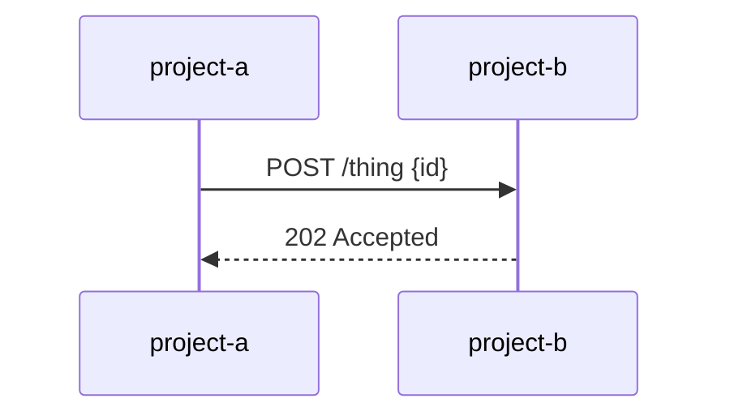

# {{title}}

What triggers this flow and what it achieves.

## Steps and contracts
1. `project-a` → `project-b`: payload, auth, errors, retries

## Versions
| Project | From version |
|---|---|
| [[provider-owner-repo]] | 2.4.0 |

Feature: [[feature-note]] · Ticket: [[TICKET-ID]]
